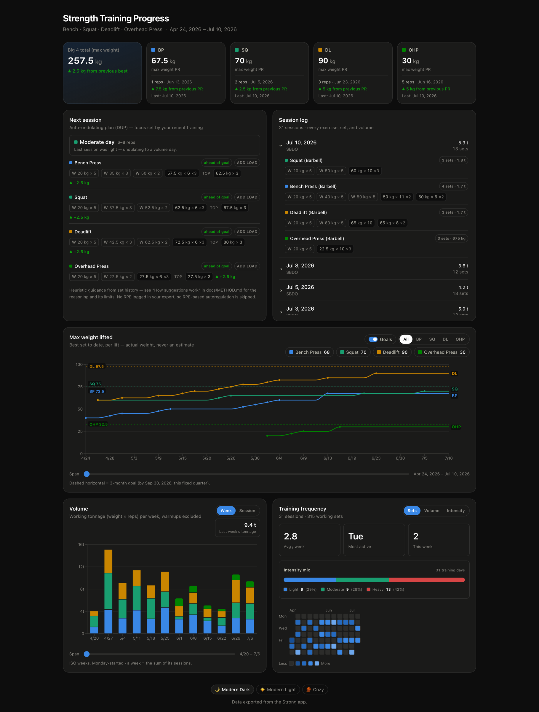

# Strength Training Progress

A dashboard for the big four barbell lifts — **bench press, squat, deadlift, overhead press** — built
from a [Strong app](https://www.strong.app/) CSV export. It tracks what you've lifted, tells you what
to lift next, and is honest about how confident it is. Static site, no backend, free on GitHub Pages.

### **[→ Live dashboard](https://ys-math.github.io/strength-training/)**



## What it shows

> **Every number on the page is a weight you actually lifted.** No estimated 1RM is ever plotted,
> labelled, or printed. (An estimate does run *inside* the suggestion engine, where it has to — it
> decides what you're told to lift, and is never drawn as if it were something you did lift.)

- **Big 4 total & PR cards** — each lift's heaviest set to date, and the four summed into one
  climbing number.
- **Next session** — a full, ordered plan per lift: warmup ramp, working sets, and a heavy top set.
  The focus (heavy / moderate / light) undulates automatically off your last session.
- **Session log** — every exercise, set, and volume per workout, latest already open.
- **Progress** — the headline chart, with an **All / BP / SQ / DL / OHP** scope selector; the
  per-lift view drills into the individual sets you performed.
- **Volume** — working tonnage, by week (*"am I doing enough?"*) or by session (*"was that day
  unusually heavy?"*, measured against your trailing 6-session average).
- **Training frequency** — a calendar heatmap, shaded by sets, tonnage, or how heavy the day was.

Three themes (dark, light, cozy); your choice is remembered.

### Reading the two charts that lie to you

The rest of the page is what it looks like. These two aren't, and both misread in a specific
direction — worth 30 seconds:

**The `All` chart plots your best *to date*, so it can never fall.** A deload or a layoff shows up as
a **flat line, not a dip** — the record didn't drop, you just didn't beat it. That's why dots mark
only the sessions where the record actually advanced: a flat stretch with no dots is the "nothing new
here" signal. To see a lift actually go down, drill into it.

**In the per-lift view, the vertical axis is *volume*, not weight.** One column per session, one tray
per set, one block per rep, each block as tall as the weight lifted — so a column's height *is* that
session's tonnage, and weight, reps, sets and volume all read off one picture. The catch: the plan
**undulates**, and light days carry the most volume, so **the tallest column is usually your
*lightest* session.** In my own data a 60 kg bench day is the shortest column on the card and a 50 kg
one is the tallest. That's correct, not a glitch — this chart answers *"how much work was that?"*,
and the `All` chart answers *"how strong am I?"*. Read the actual loads from the tooltip, not from
the block heights.

## How it decides what to lift

The **Next session** card is computed from your set history alone — no template, no toggles, nothing
to configure. It runs **double progression** (add reps within a rep window, then add the smallest
plate and reset), inside **daily undulating periodization**: it classifies your last training day as
heavy, moderate or light, then deliberately undulates to a *different* focus, tracking each focus's
progression separately. It appends a heavy top set for max-strength specificity, backs the load off
automatically after a layoff, and aims at a per-lift 3-month target projected from your own recent
rate — bounded by diminishing returns, so a hot streak can't extrapolate to an absurd number.

Because it undulates, **the card will often contradict your last session** (you went heavy, so it
suggests light). That's the design, and the banner on the card tells you why.

📐 **[docs/METHOD.md](docs/METHOD.md)** has the full accounting: every rule, its formula, and an
honest rating of whether the theory behind it is close to a law or whether the implementation is a
heuristic squeezed out of weight-and-reps data.

## Use it with your own data

1. **Fork this repo**, then drop your Strong export in at the root as `strong_workouts.csv`
   (Strong: **Settings → Export Data**). It's the single source of truth — bundled at build time, no
   runtime fetch.
2. **Point Vite at your repo name**: set `base` in `vite.config.ts` to `/<your-repo>/`.
3. **Enable Pages**: *Settings → Pages → Source: **GitHub Actions***.
4. **Push to `main`.** [The workflow](.github/workflows/deploy.yml) builds and deploys automatically.

Updating is the same file swap: replace the CSV, commit, push. Weights are read as **kg**, straight
from the export, with no conversion.

<details>
<summary><b>Optional: auto-sync new exports from iCloud Drive (macOS)</b></summary>

Strong has no API, so the export itself is still a manual tap — but everything after it can be
automatic. A LaunchAgent watches an iCloud folder, and when a new export appears that differs from
the committed one, it copies it in, commits, and pushes — which triggers the redeploy.

Then your whole update loop is: **Strong → Export → Save to Files → iCloud Drive/StrongExports.**

**One-time setup:**

1. Create the folder **iCloud Drive/StrongExports** in Finder.
2. Grant Full Disk Access to `/bin/bash` and to Terminal — iCloud Drive is privacy-protected, and a
   background job needs explicit access: **System Settings → Privacy & Security → Full Disk Access**
   → click **+** → press `Cmd+Shift+G` → type `/bin/bash` → add it. Add **Terminal** the same way.
3. Install the agent:
   ```bash
   cp scripts/com.ys-math.strength-training.sync.plist ~/Library/LaunchAgents/
   launchctl bootstrap gui/$(id -u) ~/Library/LaunchAgents/com.ys-math.strength-training.sync.plist
   ```
4. Watch it work: `tail -f ~/Library/Logs/strength-training-sync.log`

To pause or remove it:

```bash
launchctl bootout gui/$(id -u) ~/Library/LaunchAgents/com.ys-math.strength-training.sync.plist
```

The script itself is [`scripts/sync-data.sh`](scripts/sync-data.sh); it hash-compares before
committing, so it never makes an empty commit.

</details>

## Development

```bash
npm install
npm run dev      # http://localhost:5173/strength-training/
npm run build    # production build → dist/  (also the type-check gate)
npm run preview  # serve the production build
npm run test     # Vitest — the metrics, suggestions, and goals
```

The whole app is a one-directional pipeline with no backend and no runtime fetch:

```
strong_workouts.csv  ──?raw──▶  parse.ts  ──▶  metrics.ts  ──▶  components/
   the only data source          SetRow[]      pure functions      the views
```

Everything interesting is a pure function over `SetRow[]` in `metrics.ts`, which is why the tests can
cover the engine without rendering anything. Architecture, conventions, and the reasoning behind the
layout live in **[CLAUDE.md](CLAUDE.md)**.

## Stack

Vite · React · TypeScript · Tailwind CSS · Recharts · PapaParse
