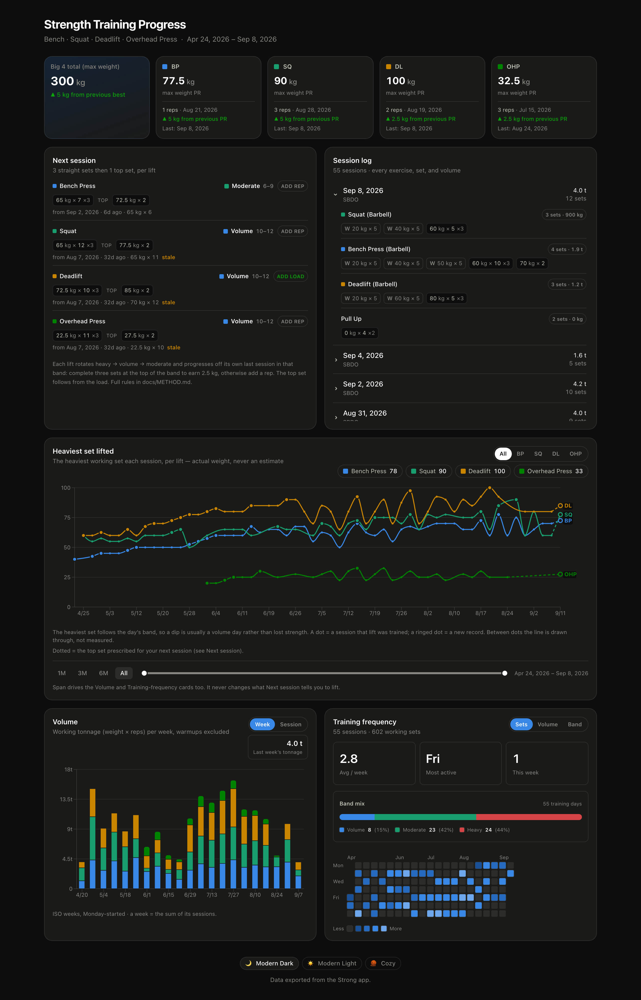

# Strength Training Progress

A dashboard for the big four barbell lifts — **bench press, squat, deadlift, overhead press** — built
from a [Strong app](https://www.strong.app/) CSV export. It tracks what you've lifted and tells you
what to lift next. Static site, no backend, free on GitHub Pages.

### **[→ Live dashboard](https://ys-math.github.io/strength-training/)**



## What it shows

> **Every number on the page is a weight you actually lifted.** There is no estimated 1RM anywhere in
> the codebase — not plotted, not printed, and not inside the engine either.

- **Big 4 total & PR cards** — each lift's heaviest set to date, and the four summed.
- **Next session** — per lift, 3 straight sets in a rep band plus 1 top set, with the session it
  progressed from. No warmup ramp; warmups are yours to judge.
- **Session log** — every exercise, set, and volume per workout, latest already open.
- **Heaviest set lifted** — the headline chart, with an **All / BP / SQ / DL / OHP** scope
  selector. The per-lift view drills into the individual sets you performed.
- **Volume** — working tonnage, by week (*"am I doing enough?"*) or by session (*"was that day
  unusually heavy?"*, against your trailing 6-session average).
- **Training frequency** — a calendar heatmap, shaded by sets, tonnage, or the day's rep band.

A **date range** under the top-set chart drives all four charts at once. It filters charts only: the next-session
prescription, the all-time records and the heatmap's colour scale always read your full history, so
narrowing the view can never change what you are told to lift.

Three themes (dark, light, cozy); your choice is remembered.

## How it decides what to lift

Daily undulating periodization with double progression. Each lift rotates **heavy (3–5) → volume
(10–12) → moderate (6–9)** off its own last session, and keeps one progression track per band.
Complete three sets at the top of a band and the load goes up 2.5 kg; otherwise add a rep. The top set
is 2 reps at the straight-set load divided by 0.95, 0.90 or 0.85 depending on the band.

There are no goals and no deload rule. A track you have not trained in weeks still gets its plate
step, and the card shows you how old the reference is rather than adjusting behind your back.

The whole algorithm is one file, [`src/lib/engine.ts`](src/lib/engine.ts), about 300 lines including
its comments. **[docs/METHOD.md](docs/METHOD.md)** is that file in prose, with a worked example.

## Use it with your own data

1. **Fork this repo**, then drop your Strong export in at the root as `strong_workouts.csv`
   (Strong: **Settings → Export Data**). It's the single source of truth — bundled at build time, no
   runtime fetch.
2. **Point Vite at your repo name**: set `base` in `vite.config.ts` to `/<your-repo>/`.
3. **Enable Pages**: *Settings → Pages → Source: **GitHub Actions***.
4. **Push to `main`.** [The workflow](.github/workflows/deploy.yml) builds and deploys automatically.

Updating is the same file swap: replace the CSV, commit, push. Weights are read as **kg**, straight
from the export, with no conversion.

<details>
<summary><b>Optional: auto-sync new exports from iCloud Drive (macOS)</b></summary>

Strong has no API, so the export itself is still a manual tap — but everything after it can be
automatic. A LaunchAgent watches an iCloud folder, and when a new export appears that differs from
the committed one, it copies it in, commits, and pushes — which triggers the redeploy.

Then your whole update loop is: **Strong → Export → Save to Files → iCloud Drive/StrongExports.**

**One-time setup:**

1. Create the folder **iCloud Drive/StrongExports** in Finder.
2. Grant Full Disk Access to `/bin/bash` and to Terminal — iCloud Drive is privacy-protected, and a
   background job needs explicit access: **System Settings → Privacy & Security → Full Disk Access**
   → click **+** → press `Cmd+Shift+G` → type `/bin/bash` → add it. Add **Terminal** the same way.
3. Install the agent:
   ```bash
   cp scripts/com.ys-math.strength-training.sync.plist ~/Library/LaunchAgents/
   launchctl bootstrap gui/$(id -u) ~/Library/LaunchAgents/com.ys-math.strength-training.sync.plist
   ```
4. Watch it work: `tail -f ~/Library/Logs/strength-training-sync.log`

To pause or remove it:

```bash
launchctl bootout gui/$(id -u) ~/Library/LaunchAgents/com.ys-math.strength-training.sync.plist
```

The script itself is [`scripts/sync-data.sh`](scripts/sync-data.sh); it hash-compares before
committing, so it never makes an empty commit.

</details>

## Development

```bash
npm install
npm run dev      # http://localhost:5173/strength-training/
npm run build    # production build → dist/  (also the type-check gate)
npm run preview  # serve the production build
npm run test     # Vitest — the engine, plus a golden test over a frozen CSV
```

The whole app is a one-directional pipeline with no backend and no runtime fetch:

```
                              ┌─▶  engine.ts   ──▶  what to lift next
strong_workouts.csv ──?raw──▶ parse.ts ──▶ SetRow[]
   the only data source       ├─▶  metrics.ts  ──▶  what you have done
                              └────────────────────▶  components/
```

Everything is a pure function over `SetRow[]`, which is why the tests cover the engine without
rendering anything. Architecture and conventions live in **[CLAUDE.md](CLAUDE.md)**.

## Stack

Vite · React · TypeScript · Tailwind CSS · Recharts · PapaParse
